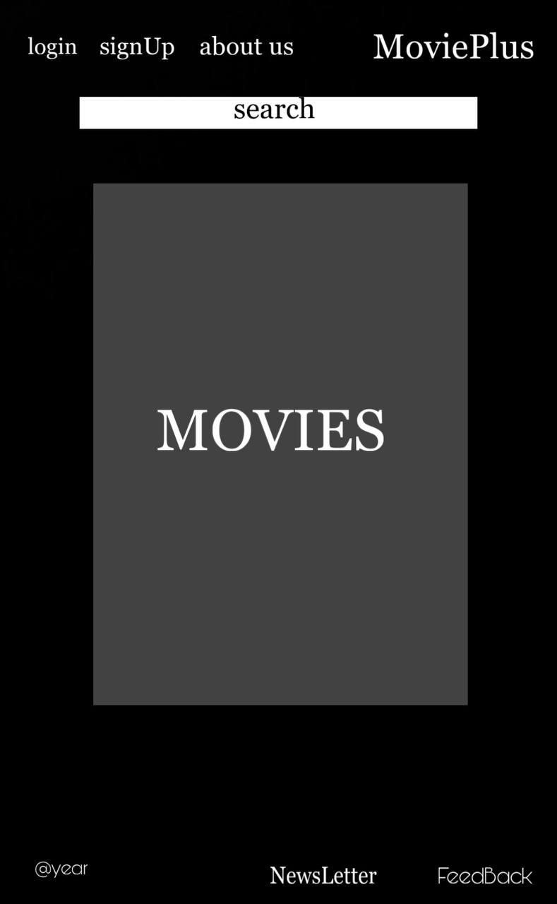
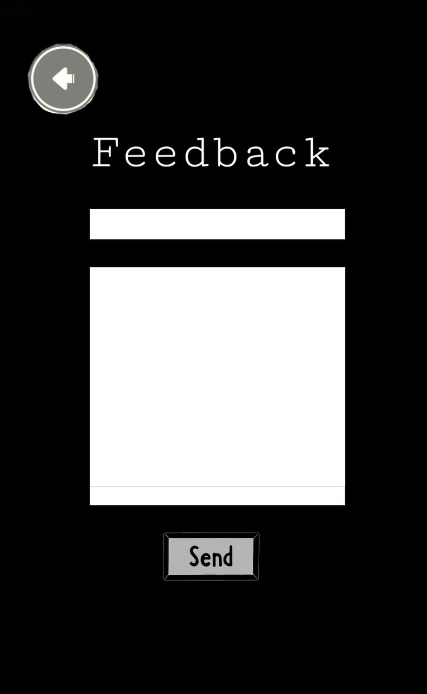
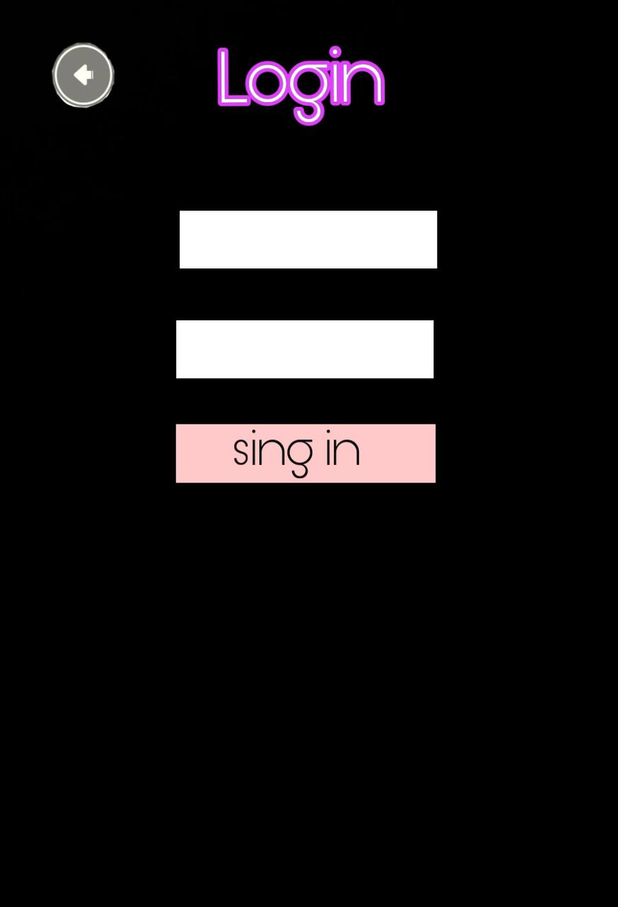

# MoviePlus Rakendus

MoviePlus on dünaamiline veebirakendus, mis on loodud filmihuvilistele ja pakub mitmeid funktsioone, et suurendada teie filmivaatamise kogemust. Alates laia filmikollektsiooni uurimisest kuni isikliku filmikapi ja päeviku haldamiseni on MoviePlus teie peamine platvorm kõiges kinoga seotus.

## Funktsioonid

### 1. Filmide Otsing

- Otsige nii klassikalisi kui ka kaasaegseid filme.
- Saage üksikasjalikku teavet iga filmi kohta, sealhulgas lühikest kirjeldust kiirete ülevaadete jaoks.

### 2. Sisselogimine

- Registreeritud kasutajad saavad sisse logida, et avada isikupärased funktsioonid.

### 3. Filmide Žanrid

- Uurige filme žanrite järgi kategooriates.
- Leidke ja avastage filme hõlpsalt oma eelistatud žanri alusel.

### 4. Tagasiside

- Anna tagasisidet platvormi kohta.
- Jälgige platvormi arengut ja lisage oma panus selle täiustamisse.

### 5. Uudiskiri

- Liitu uudiskirjaga, et saada regulaarselt teavet saidi uuenduste, uute funktsioonide ja kinomaailma uudiste kohta.

### 6. Meist Leht

- Tutvuge MoviePlus meeskonnaga

## Kasutatud Tehnoloogiad

- React
- React Router
- Material UI
- [Supabase]

# Wireframe

- Main page

- About us page

- Feedback page

- Newsletter page

- Search page

- Movies description page

- Sign up page

- Login page

- Main page (sign in)

